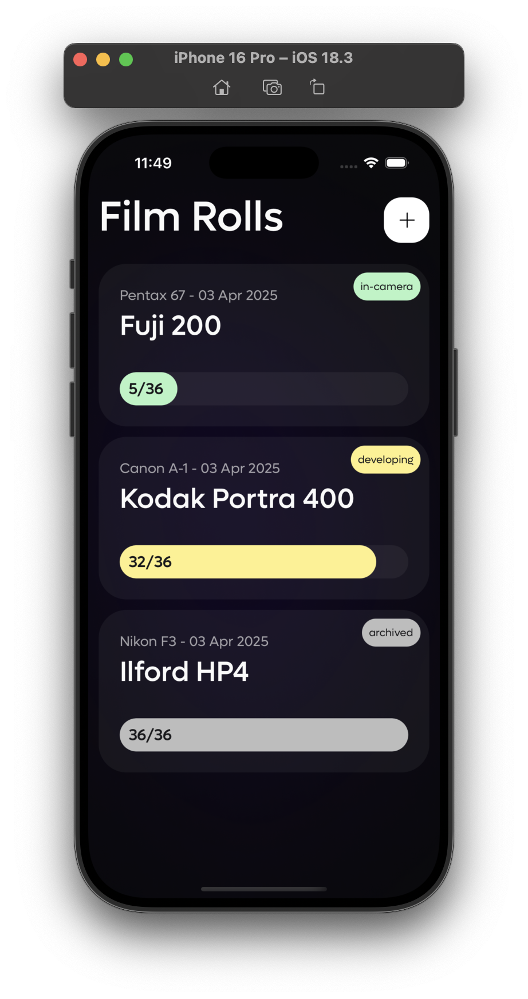
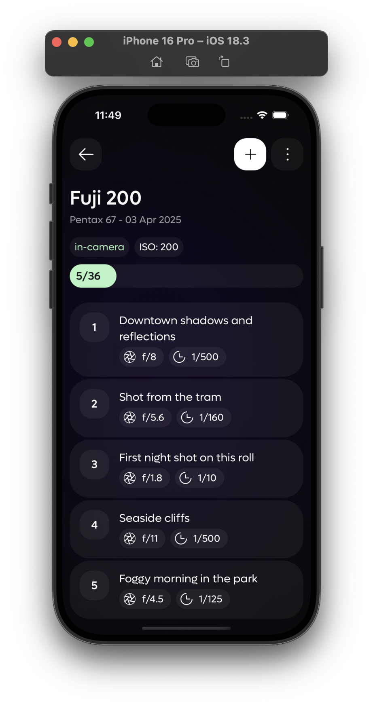
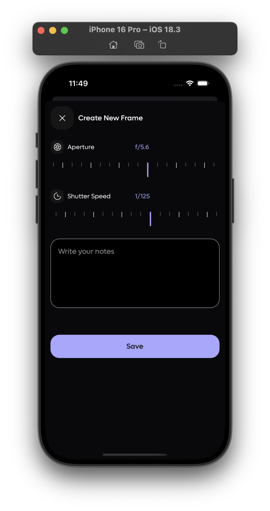

# 🎞️ Rollio – Analog Photography Log

**Rollio** is a simple and elegant app for analog photographers to track their film rolls and individual frames.

No logins. No cloud. Just you, your camera, and the notes that matter.

---

## ✨ Features

- 📷 Create film rolls with film stock, ISO, and camera used
- 📝 Log individual frames with notes and exposure settings
- 🗂 Organize and archive your film photography sessions
- 🔒 100% offline – all data is stored locally on your device
- 🧘 Minimal UI designed for focus and speed

---

## 📱 Platforms

- **iOS:** Available on the [App Store](https://apps.apple.com/app/rollio-analog-photography-log/id6744120369) (Currently pending EU availability via DSA compliance)
- **Android:** Coming soon to the Play Store   
  

---

## 📸 Screenshots

---

## 🚧 Roadmap

You can find the full roadmap and upcoming features in the [changelog](./CHANGELOG.md), including:

- Frame editing
- Push/pull settings
- Photo attachments
- Export to PDF
- Light meter (planned)

---

## 🛠 Built With

- [Expo](https://expo.dev/)
- [React Native](https://reactnative.dev/)
- [Expo SQLite](https://docs.expo.dev/versions/latest/sdk/sqlite/)

---

## 📄 License

MIT License — see [LICENSE](./LICENSE) for details.

---

## ❤️ Acknowledgments

Thanks to the awesome [analog photography community on Reddit](https://www.reddit.com/r/AnalogCommunit) for the feedback, support, and feature suggestions!

---

*Film is not dead 🎞*

